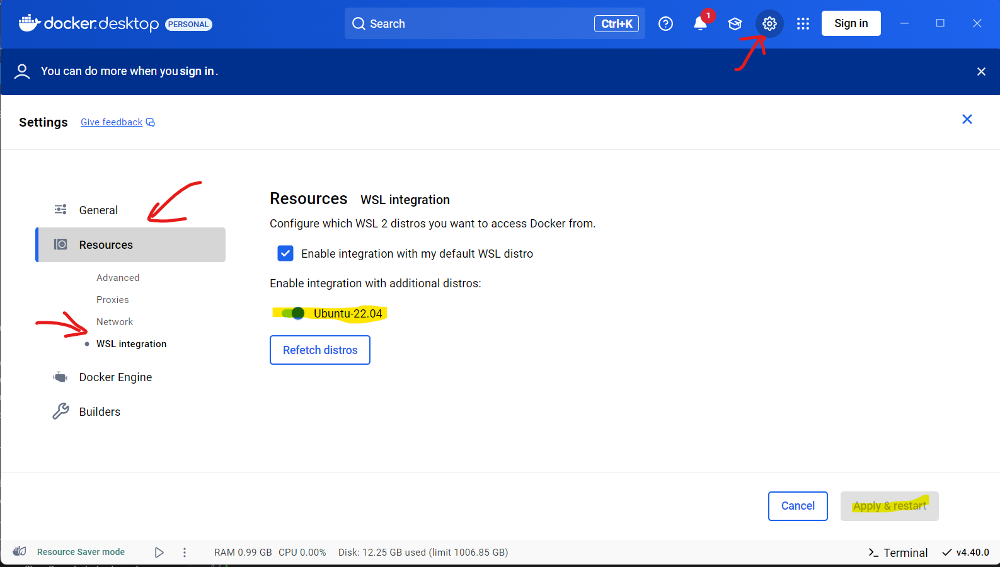
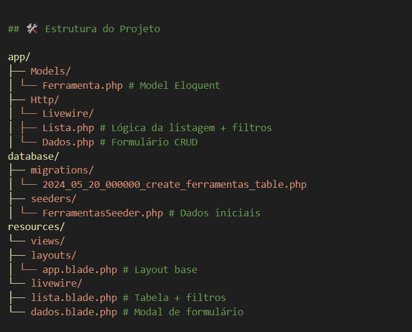

# Gerenciador de Ferramentas - Exercício Técnico

## 🚀 Tecnologias Utilizadas

- Laravel 10
- Livewire 2
- Bootstrap 5 (via CDN)
- SQL Server 2017+
- Docker (com WSL 2)
- PHP 8.1+
- Composer

## 📦 Requisitos

Antes de iniciar, verifique se você tem os seguintes requisitos instalados:

- [WSL 2](https://learn.microsoft.com/en-us/windows/wsl/install)
- [Docker Desktop](https://www.docker.com/)
- Git

## 🚀 Instalação

### Pré-requisitos Obrigatórios
1. **Habilitar WSL 2**:
Insira esse comando no wsl:  
wsl --install -d Ubuntu-22.04  
Reinicie o computador após a instalação  
Instalar Docker Desktop:
Baixe em docker.com/products/docker-desktop  
Durante a instalação:  
Marque "Use WSL 2 instead of Hyper-V"

Em Settings → WSL Integration: habilite o Ubuntu-22.04

Instalar Git Bash:

git-scm.com/download/win

Use todas opções padrão

Passo a Passo
Iniciar Ambiente WSL:

Abra o Ubuntu 22.04 no Menu Iniciar

Atualize os pacotes:

bash
sudo apt update && sudo apt upgrade -y
Clonar Repositório:

### 1. Clonar repositório

git clone https://github.com/micael-ricardo/toolsapp.git  
cd Toolsapp

### Garanta que o Docker Desktop está RODANDO
docker-compose up -d

### Rode a Migrate
docker ps   
Para validar os nomes dos containers se for laravel-sqlsrv
docker exec -it laravel-sqlsrv php artisan migrate

### Rode as seeds para popular a tabela 
docker exec -it laravel-sqlsrv php artisan db:seed

🛠️ Estrutura do Projeto

✅ Funcionalidades Implementadas
Listagem com ordenação ASC por nome

Busca por nome (com debounce de 500ms)

Filtro por status (Ativa/Inativa)

Paginação dinâmica (10/25/50 itens)

Loading states visíveis

CRUD completo em modais

Validação de formulário

Confirmação de exclusão

Migrations para SQL Server

Seeds para dados de teste

